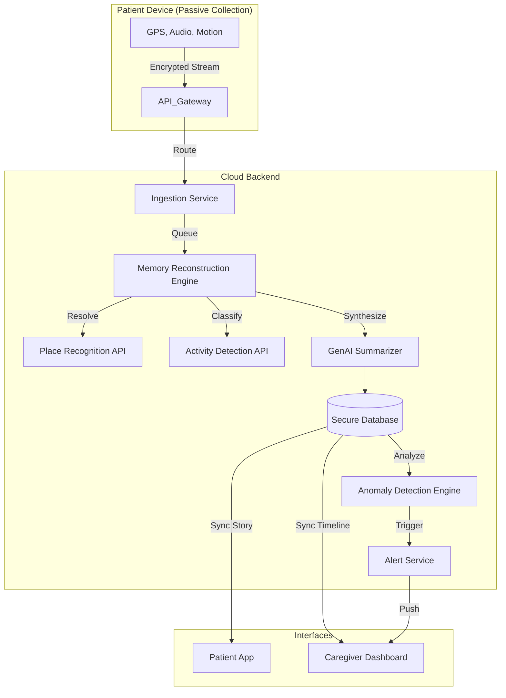

# MemoryPacket 🧠
> **"Our system does not try to make dementia patients remember — it remembers for them, calmly and safely."**

MemoryPacket is a Passive Memory Reconstruction & Caregiver Intelligence System. unlike traditional diary apps, it requires **zero active input** from the patient. It combines passive sensing, AI memory reconstruction, and a dual-mode interface to reduce anxiety for patients while empowering caregivers.

---

## 1️⃣ Core Feature Set

### A. Patient-Facing Features (Low Cognitive Load)
*Designed as a "Cognitive Prosthetic". Passive-first.*

1.  **Daily Memory Story**: Automatically generated narrative of the day in simple, chronological language (e.g., "You woke up. You went for a walk.").
2.  **Voice Playback**: One-tap "Read my day aloud" using a calm, slow-paced voice. Primary interaction mode.
3.  **Safety Reassurance**: Constant visual indicators: "You are safe", "You are at home", "Your family knows where you are."
4.  **Emergency / Confusion Mode**: A fail-safe "I am confused" button that plays reassurance messages and offers a one-tap connection to family.
5.  **Passive Activity Logging**: Zero manual input required. Background tracking only.

### B. Caregiver-Facing Features (Control + Intelligence)
*Designed for Clarity and Decision Making.*

6.  **Activity Timeline Dashboard**: Chronological view of locations, activities, and durations. Editable by caregivers to correct AI errors.
7.  **Location Monitoring (Privacy-Aware)**: precise tracking with privacy zones. Shows "Place" (e.g., "Medical Store") instead of just coordinates.
8.  **People & Routine Management**: Tag frequent contacts (Son, Neighbor) and define "Normal Routines" for anomaly detection.
9.  **Anomaly Detection Alerts**: Triggered by route deviations, missed locations, or unusual inactivity.
10. **Manual Event Injection**: Caregivers can inject medical events (e.g., "Taken Medicine") into the patient's timeline.

### C. System-Level Features
11. **Memory Reconstruction Engine**: Converts raw sensor data (GPS, Audio, Motion) into human stories.
12. **Data Privacy & Control**: Encrypted storage with caregiver-controlled access.
13. **Scalability & Fault Tolerance**: Modular microservices architecture with offline caching and graceful degradation.

---

## 2️⃣ System Architecture & APIs

### How It All Connects
Sensor data from the patient’s device is passively collected and sent to the backend, where it is transformed into meaningful activities and locations. These are processed by the **Memory Reconstruction Engine** to generate a simple, human-readable daily story. Caregivers can review, correct, and monitor this data through their dashboard, while patients interact only with reassurance-focused summaries and voice playback. The system continuously evaluates patterns to detect anomalies and trigger alerts, ensuring safety, privacy, and scalability.

### Required Logical APIs
*Implemented via REST/Next.js Server Actions*

#### 🧩 Auth & User Management
*   **Authentication**: `POST /auth/login` (Secure access)
*   **Role Management**: `GET /user/role` (Separates Patient vs Caregiver modes)

#### 📍 Location & Movement
*   **Location Tracking**: `POST /location/update` (Lat/Long, Accuracy, Timestamp)
*   **Place Recognition**: `POST /location/resolve-place` (Converts GPS -> "Home", "Park")

#### 🚶 Activity Detection
*   **Activity Detection**: `POST /activity/log` (Walking, Sitting, Idle)

#### 🧠 Memory Reconstruction (Core)
*   **Daily Summary Generator**: `POST /summary/generate` (Logs -> Story Blocks)
*   **Summary Editing**: `PATCH /summary/update` (Human correction loop)

#### 🔊 Voice & Accessibility
*   **Text-to-Speech**: `POST /voice/speak` (Text -> Audio Stream)

#### 🚨 Alert & Safety
*   **Anomaly Detection**: `POST /alerts/evaluate` (Checks route deviations)
*   **Emergency Action**: `POST /emergency/trigger` (Notify caregiver, share location)

---

## 3️⃣ Implementation & Scalability

**Frontend Architecture:**
*   **Next.js (App Router)**: Server-side rendering for speed.
*   **Tailwind CSS**: Custom `patient` (High Contrast) and `caregiver` (Calm Blue) palettes.
*   **Accessibility First**: Large touch targets, standard-compliant contrast.

**Scalability Strategy:**
*   **Modular Services**: Ingestion, Reconstruction, and Alerting are decoupled.
*   **Database Partitioning**: Time-series sensor data sharded by User/Date.
*   **Graceful Degradation**: If AI fails, system shows raw timeline. If GPS fails, uses last known location.

---

*Built for Hack the Winter - Round 2 (System Design & Scalability)*
